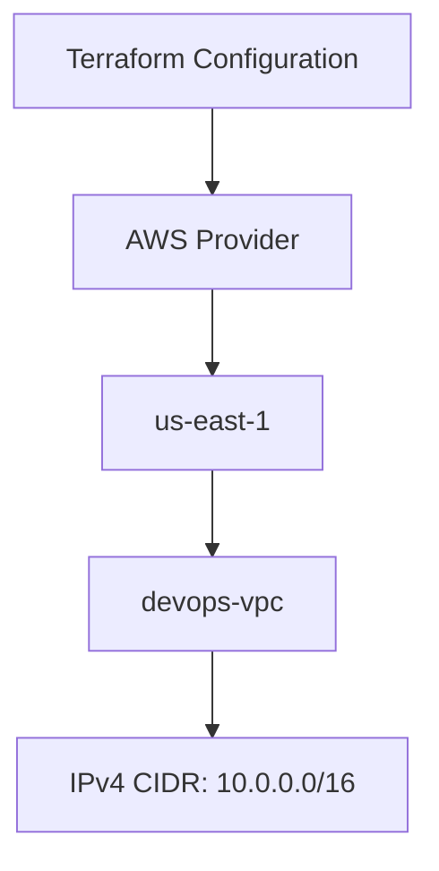

# Terraform AWS VPC Creation

## Objective

The objective of this task is to create an Amazon VPC named `devops-vpc` in the AWS `us-east-1` region using Terraform.

The Terraform configuration must be created in:

```text
/home/bob/terraform/main.tf
```

Only `main.tf` should be created for the Terraform configuration.

## Task Requirements

The following requirements must be satisfied

- Create a VPC named `devops-vpc`
- Use AWS region `us-east-1`
- Use any valid IPv4 CIDR block
- Use Terraform to provision the VPC
- Create the configuration in `/home/bob/terraform/main.tf`
- Do not create another `.tf` file

## Environment

### Terraform Working Directory

```text
/home/bob/terraform
```

### AWS Region

```text
us-east-1
```

### VPC Name

```text
devops-vpc
```

### VPC CIDR

```text
10.0.0.0/16
```

## Architecture



## Step 1: Navigate to the Terraform Directory

Open the integrated terminal from the Terraform working directory and run:

```bash
cd /home/bob/terraform
```

Verify the current directory

```bash
pwd
```

Expected

```text
/home/bob/terraform
```

## Step 2: Create main.tf

Create the required Terraform configuration

```bash
vi /home/bob/terraform/main.tf
```

```hcl
terraform {
  required_providers {
    aws = {
      source = "hashicorp/aws"
    }
  }
}

provider "aws" {
  region = "us-east-1"
}

resource "aws_vpc" "devops_vpc" {
  cidr_block = "10.0.0.0/16"

  tags = {
    Name = "devops-vpc"
  }
}
```

Save the file.

## Step 3: Initialize Terraform

Run

```bash
cd /home/bob/terraform
terraform init
```

Terraform initializes the working directory and downloads the required AWS provider.

## Step 4: Validate the Configuration

Run

```bash
terraform validate
```

Expected output

```text
Success! The configuration is valid.
```

## Step 5: Review the Execution Plan

Run

```bash
terraform plan
```

Terraform should show that it will create one AWS VPC resource

```text
aws_vpc.devops_vpc
```

## Step 6: Create the VPC

Run

```bash
terraform apply
```

Terraform will ask for confirmation.

Enter

```text
yes
```

Terraform will create the VPC in the `us-east-1` region.

## Step 7: Verify the Terraform Resource

Run

```bash
terraform state list
```

Expected

```text
aws_vpc.devops_vpc
```

You can inspect the created resource using:

```bash
terraform show
```

The configuration should show

```text
Name: devops-vpc
CIDR Block: 10.0.0.0/16
```

## Step 8: Verify the Configuration File

Make sure only the required Terraform configuration file was created:

```bash
ls -la /home/bob/terraform
```

## Main Takeaways

- Terraform can provision AWS networking resources using the AWS provider
- The AWS provider region can be configured directly in `main.tf`
- An AWS VPC requires a valid IPv4 CIDR block
- Resource tags can be used to assign the VPC name
- `terraform init` initializes the working directory
- `terraform validate` checks the configuration syntax and structure
- `terraform plan` previews infrastructure changes
- `terraform apply` provisions the defined infrastructure
- Terraform state can be used to verify the created resource

## Conclusion

The Terraform configuration was created successfully in the required working directory, and the `devops-vpc` VPC was configured for the `us-east-1` region with a valid IPv4 CIDR block. The Terraform configuration was validated and the required resource was provisioned and verified successfully.
