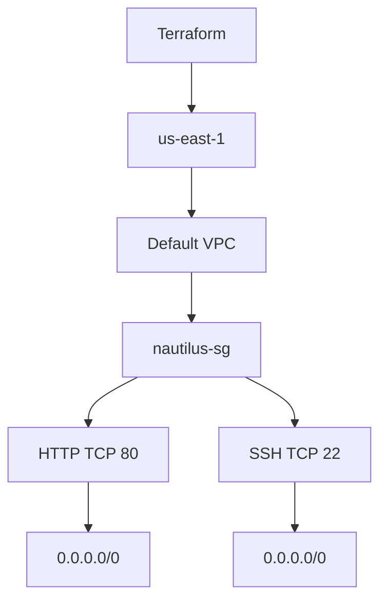

# Terraform Security Group - Nautilus App Servers

## Objective

The objective of this task is to use Terraform to create a security group named `nautilus-sg` inside the default VPC in the `us-east-1` AWS region.

The security group must allow HTTP and SSH traffic from all IPv4 addresses.

## Task Requirements

The Terraform configuration must

- Create a security group named `nautilus-sg`
- Use the description `Security group for Nautilus App Servers`
- Create the security group inside the default VPC
- Use the `us-east-1` AWS region
- Allow inbound HTTP traffic on TCP port `80`
- Allow inbound SSH traffic on TCP port `22`
- Allow both inbound rules from `0.0.0.0/0`
- Use only `/home/bob/terraform/main.tf`
- Do not create another `.tf` file

## Environment

| Component           | Value                 |
| ------------------- | --------------------- |
| Terraform Directory | `/home/bob/terraform` |
| Terraform File      | `main.tf`             |
| AWS Region          | `us-east-1`           |
| VPC                 | Default VPC           |
| Security Group      | `nautilus-sg`         |
| HTTP Port           | `80`                  |
| SSH Port            | `22`                  |
| Source CIDR         | `0.0.0.0/0`           |

## Architecture



## Step 1: Navigate to the Terraform Directory

```bash
cd /home/bob/terraform
```

If an old `provider.tf` exists from another task, remove it because this task requires only `main.tf`.

```bash
rm -f provider.tf
```

## Step 2: Create main.tf

Create

```text
/home/bob/terraform/main.tf
```

Use the following configuration:

```hcl
terraform {
  required_providers {
    aws = {
      source  = "hashicorp/aws"
      version = "5.91.0"
    }
  }
}

provider "aws" {
  region                      = "us-east-1"
  skip_credentials_validation = true
  skip_requesting_account_id  = true
  s3_use_path_style           = true

  endpoints {
    ec2            = "http://aws:4566"
    apigateway     = "http://aws:4566"
    cloudformation = "http://aws:4566"
    cloudwatch     = "http://aws:4566"
    dynamodb       = "http://aws:4566"
    es             = "http://aws:4566"
    firehose       = "http://aws:4566"
    iam            = "http://aws:4566"
    kinesis        = "http://aws:4566"
    lambda         = "http://aws:4566"
    route53        = "http://aws:4566"
    redshift       = "http://aws:4566"
    s3             = "http://aws:4566"
    secretsmanager = "http://aws:4566"
    ses            = "http://aws:4566"
    sns            = "http://aws:4566"
    sqs            = "http://aws:4566"
    ssm            = "http://aws:4566"
    stepfunctions  = "http://aws:4566"
    sts            = "http://aws:4566"
    rds            = "http://aws:4566"
  }
}

resource "aws_security_group" "nautilus_sg" {
  name        = "nautilus-sg"
  description = "Security group for Nautilus App Servers"
  vpc_id      = data.aws_vpc.default.id

  ingress {
    description = "HTTP"
    from_port   = 80
    to_port     = 80
    protocol    = "tcp"
    cidr_blocks = ["0.0.0.0/0"]
  }

  ingress {
    description = "SSH"
    from_port   = 22
    to_port     = 22
    protocol    = "tcp"
    cidr_blocks = ["0.0.0.0/0"]
  }

  egress {
    from_port   = 0
    to_port     = 0
    protocol    = "-1"
    cidr_blocks = ["0.0.0.0/0"]
  }

  tags = {
    Name = "nautilus-sg"
  }
}

data "aws_vpc" "default" {
  default = true
}
```

## Step 3: Initialize Terraform

Run

```bash
terraform init
```

Terraform downloads and initializes the required AWS provider.

## Step 4: Validate the Configuration

Run

```bash
terraform validate
```

A successful validation should return

```text
Success! The configuration is valid.
```

## Step 5: Review the Terraform Plan

Run

```bash
terraform plan
```

Terraform should identify the security group as a resource to be created.

The configuration should associate the security group with the default VPC.

## Step 6: Create the Security Group

Run

```bash
terraform apply
```

Confirm the operation by entering

```text
yes
```

Terraform should complete successfully and report that one resource was created.

## Step 7: Verify Terraform State

Run:

```bash
terraform state list
```

The output should include

```text
data.aws_vpc.default
aws_security_group.nautilus_sg
```

You can inspect the complete resource configuration with

```bash
terraform show
```

Verify that the security group contains

```text
Name: nautilus-sg
Description: Security group for Nautilus App Servers
```

## Main Takeaways

- Terraform can retrieve an existing default VPC using a data source
- A security group can then be created using the VPC ID returned by that data source
- Inbound HTTP traffic uses TCP port `80`
- Inbound SSH traffic uses TCP port `22`
- `0.0.0.0/0` allows traffic from any IPv4 address
- Terraform configurations in the same directory are loaded together, so duplicate provider configurations should be avoided
- The task requires all configuration to be contained in `main.tf`

## Conclusion

The Terraform configuration was created in `/home/bob/terraform/main.tf` and the required security group configuration was set up for the default VPC in `us-east-1`. The configuration was validated and the security group was created and verified successfully.
