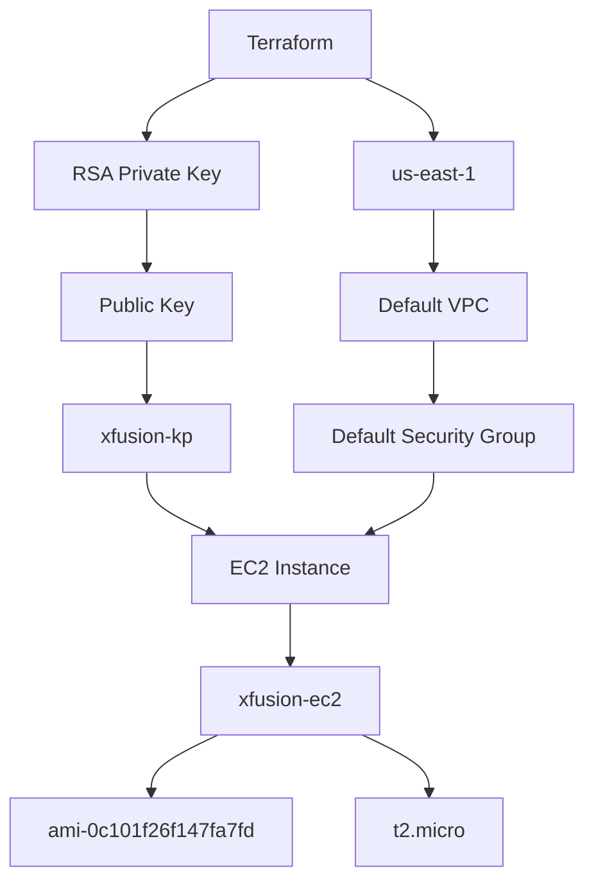

# Terraform EC2 Instance - xfusion-ec2

## Objective

The objective of this task is to use Terraform to provision an EC2 instance in the `us-east-1` region according to the requirements provided by the Nautilus DevOps team.

The EC2 instance must use the specified Amazon Linux AMI, instance type, RSA key pair, and default security group.

## Task Requirements

The Terraform configuration must

- Create an EC2 instance
- Use `xfusion-ec2` as the Name tag
- Use AMI `ami-0c101f26f147fa7fd`
- Use instance type `t2.micro`
- Create a new RSA key pair named `xfusion-kp`
- Attach the default security group
- Use the `us-east-1` region
- Store the Terraform configuration in `/home/bob/terraform/main.tf`
- Do not create another `.tf` configuration file

## Environment

| Component           | Value                   |
| ------------------- | ----------------------- |
| Terraform Directory | `/home/bob/terraform`   |
| Terraform File      | `main.tf`               |
| AWS Region          | `us-east-1`             |
| Instance Name       | `xfusion-ec2`           |
| AMI                 | `ami-0c101f26f147fa7fd` |
| Instance Type       | `t2.micro`              |
| Key Pair            | `xfusion-kp`            |
| Key Algorithm       | RSA                     |
| Security Group      | Default                 |
| VPC                 | Default VPC             |

## Architecture



## Step 1: Navigate to the Terraform Directory

Run:

```bash
cd /home/bob/terraform
```

Because the task requires only `main.tf`, remove an old provider file if it exists

```bash
rm -f provider.tf
```

Verify the directory

```bash
ls -la
```

## Step 2: Create main.tf

Create the following file

```text
/home/bob/terraform/main.tf
```

The Terraform configuration defines the AWS and TLS providers, discovers the default VPC and security group, generates an RSA key, creates the AWS key pair, and provisions the EC2 instance.

```hcl
terraform {
  required_providers {
    aws = {
      source  = "hashicorp/aws"
      version = "5.91.0"
    }

    tls = {
      source = "hashicorp/tls"
    }
  }
}

provider "aws" {
  region                      = "us-east-1"
  skip_credentials_validation = true
  skip_requesting_account_id  = true
  s3_use_path_style           = true

  endpoints {
    ec2            = "http://aws:4566"
    apigateway     = "http://aws:4566"
    cloudformation = "http://aws:4566"
    cloudwatch     = "http://aws:4566"
    dynamodb       = "http://aws:4566"
    es             = "http://aws:4566"
    firehose       = "http://aws:4566"
    iam            = "http://aws:4566"
    kinesis        = "http://aws:4566"
    lambda         = "http://aws:4566"
    route53        = "http://aws:4566"
    redshift       = "http://aws:4566"
    s3             = "http://aws:4566"
    secretsmanager = "http://aws:4566"
    ses            = "http://aws:4566"
    sns            = "http://aws:4566"
    sqs            = "http://aws:4566"
    ssm            = "http://aws:4566"
    stepfunctions  = "http://aws:4566"
    sts            = "http://aws:4566"
    rds            = "http://aws:4566"
  }
}

provider "tls" {}

data "aws_security_group" "default" {
  name   = "default"
  vpc_id = data.aws_vpc.default.id
}

data "aws_vpc" "default" {
  default = true
}

resource "tls_private_key" "xfusion_kp" {
  algorithm = "RSA"
  rsa_bits  = 4096
}

resource "aws_key_pair" "xfusion_kp" {
  key_name   = "xfusion-kp"
  public_key = tls_private_key.xfusion_kp.public_key_openssh
}

resource "aws_instance" "xfusion_ec2" {
  ami           = "ami-0c101f26f147fa7fd"
  instance_type = "t2.micro"
  key_name      = aws_key_pair.xfusion_kp.key_name

  security_groups = [
    data.aws_security_group.default.name
  ]

  tags = {
    Name = "xfusion-ec2"
  }
}
```

## Step 3: Initialize Terraform

Run

```bash
terraform init
```

Terraform initializes the AWS and TLS providers.

## Step 4: Validate the Configuration

Run

```bash
terraform validate
```

## Step 5: Review the Plan

Run

```bash
terraform plan
```

The default VPC and default security group are retrieved using Terraform data sources.

## Step 6: Create the EC2 Instance

Run

```bash
terraform apply
```

Confirm the operation by entering

```text
yes
```

Terraform should successfully create the RSA key, AWS key pair, and EC2 instance.

## Step 7: Verify Terraform State

Run

```bash
terraform state list
```

Then inspect the configuration

```bash
terraform show
```

## Main Takeaways

- Terraform can retrieve an existing default VPC using a data source
- The default security group can be retrieved from the default VPC
- The TLS provider can generate an RSA key pair
- `aws_key_pair` registers the generated public key with AWS
- The EC2 instance can reference the Terraform-created key pair
- Terraform can provision the complete EC2 configuration from a single `main.tf` file
- The instance uses the required Amazon Linux AMI and `t2.micro` instance type

## Conclusion

The Terraform configuration was created in `/home/bob/terraform/main.tf`. The required RSA key pair, AWS key pair, and EC2 instance configuration were set up using the specified AMI, instance type, default security group, and `xfusion-ec2` Name tag. The Terraform configuration was validated and the required resources were provisioned successfully.
