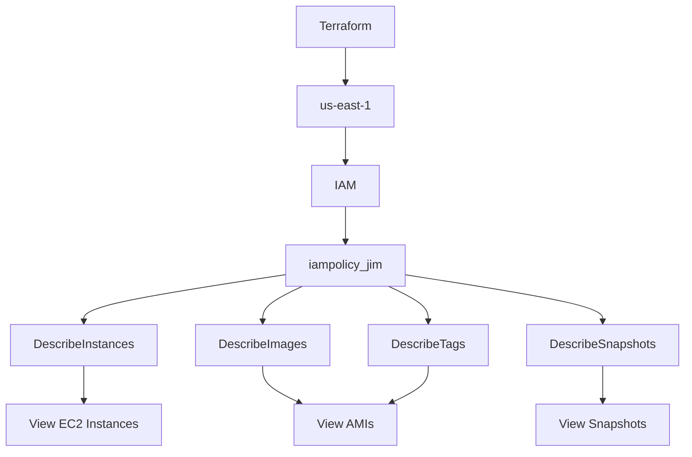

# Terraform IAM Policy - iampolicy_jim

## Objective

The objective of this task is to use Terraform to create an IAM policy named `iampolicy_jim`.

The policy provides read-only access to the Amazon EC2 console so users can view EC2 instances, AMIs, and snapshots.

## Task Requirements

The Terraform configuration must

- Create an IAM policy named `iampolicy_jim`
- Configure the AWS provider for the `us-east-1` region
- Allow users to view EC2 instances
- Allow users to view AMIs
- Allow users to view snapshots
- Allow users to view the required EC2 tag information
- Grant read-only permissions only
- Use `/home/bob/terraform/main.tf`
- Do not create another `.tf` file

## Environment

| Component           | Value                       |
| ------------------- | --------------------------- |
| Terraform Directory | `/home/bob/terraform`       |
| Terraform File      | `main.tf`                   |
| AWS Region          | `us-east-1`                 |
| IAM Policy Name     | `iampolicy_jim`             |
| Policy Type         | Customer-managed IAM policy |
| EC2 Instances       | Read-only                   |
| AMIs                | Read-only                   |
| Snapshots           | Read-only                   |

## Architecture



## Step 1: Navigate to the Terraform Directory

Run

```bash
cd /home/bob/terraform
```

Because the task requires only `main.tf`, remove an old provider file if it exists

```bash
rm -f provider.tf
```

Verify the directory

```bash
ls -la
```

## Step 2: Create main.tf

Create

```text
/home/bob/terraform/main.tf
```

Use the following configuration

```hcl
terraform {
  required_providers {
    aws = {
      source  = "hashicorp/aws"
      version = "5.91.0"
    }
  }
}

provider "aws" {
  region                      = "us-east-1"
  skip_credentials_validation = true
  skip_requesting_account_id  = true
  s3_use_path_style           = true

  endpoints {
    ec2            = "http://aws:4566"
    apigateway     = "http://aws:4566"
    cloudformation = "http://aws:4566"
    cloudwatch     = "http://aws:4566"
    dynamodb       = "http://aws:4566"
    es             = "http://aws:4566"
    firehose       = "http://aws:4566"
    iam            = "http://aws:4566"
    kinesis        = "http://aws:4566"
    lambda         = "http://aws:4566"
    route53        = "http://aws:4566"
    redshift       = "http://aws:4566"
    s3             = "http://aws:4566"
    secretsmanager = "http://aws:4566"
    ses            = "http://aws:4566"
    sns            = "http://aws:4566"
    sqs            = "http://aws:4566"
    ssm            = "http://aws:4566"
    stepfunctions  = "http://aws:4566"
    sts            = "http://aws:4566"
    rds            = "http://aws:4566"
  }
}

resource "aws_iam_policy" "iampolicy_jim" {
  name        = "iampolicy_jim"
  description = "Read-only access to EC2 instances, AMIs and snapshots"

  policy = jsonencode({
    Version = "2012-10-17"

    Statement = [
      {
        Effect = "Allow"

        Action = [
          "ec2:DescribeInstances",
          "ec2:DescribeImages",
          "ec2:DescribeTags",
          "ec2:DescribeSnapshots"
        ]

        Resource = "*"
      }
    ]
  })
}
```

## Step 3: Initialize Terraform

Run

```bash
terraform init
```

Terraform initializes the required AWS provider.

## Step 4: Validate the Configuration

Run

```bash
terraform validate
```

Expected output

```text
Success! The configuration is valid.
```

## Step 5: Review the Terraform Plan

Run

```bash
terraform plan
```

Terraform should show that the following resource will be created

```text
aws_iam_policy.iampolicy_jim
```

## Step 6: Create the IAM Policy

Run

```bash
terraform apply
```

Confirm the operation by entering

```text
yes
```

Terraform should report that one resource was created.

## Step 7: Verify Terraform State

Run

```bash
terraform state list
```

Expected Output

```text
aws_iam_policy.iampolicy_jim
```

Inspect the complete resource

```bash
terraform show
```

Verify the policy name

```text
iampolicy_jim
```

## Main Takeaways

- Terraform can create customer-managed IAM policies using `aws_iam_policy`
- IAM policies define permissions using JSON policy documents
- EC2 `Describe` actions provide read-only access to EC2 information
- `DescribeInstances` allows viewing instances
- `DescribeImages` allows viewing AMIs
- `DescribeSnapshots` allows viewing snapshots
- `DescribeTags` provides the tag information required by the EC2 console when displaying public AMIs
- The policy uses `Resource = "*"` because EC2 `Describe*` actions do not support resource-level permissions

## Conclusion

The Terraform configuration was created in `/home/bob/terraform/main.tf`, and the `iampolicy_jim` IAM policy was configured with the required read-only EC2 permissions. The Terraform configuration was validated and the required IAM policy was created and verified successfully.
