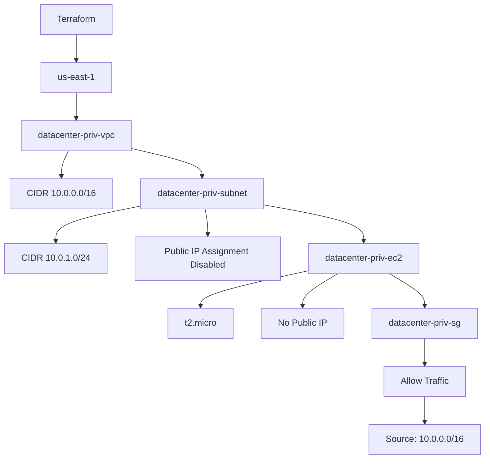

# Terraform Private VPC, Subnet and EC2 Instance

## Objective

The objective of this task is to use Terraform to provision a private AWS VPC, a private subnet, a security group, and an EC2 instance.

The infrastructure must remain private, with no automatic public IP assignment, and the EC2 security group must allow access only from within the VPC CIDR block.

## Task Requirements

The Terraform configuration must

- Create a VPC named `datacenter-priv-vpc`
- Use the VPC CIDR block `10.0.0.0/16`
- Create a subnet named `datacenter-priv-subnet`
- Use the subnet CIDR block `10.0.1.0/24`
- Disable automatic public IP assignment on the subnet
- Create an EC2 instance named `datacenter-priv-ec2`
- Use instance type `t2.micro`
- Place the EC2 instance inside the newly created private subnet
- Disable public IP assignment on the EC2 instance
- Create a security group for the EC2 instance
- Allow security group access only from the VPC CIDR block `10.0.0.0/16`
- Use `KKE_VPC_CIDR` as the VPC CIDR variable
- Use `KKE_SUBNET_CIDR` as the subnet CIDR variable
- Use `KKE_vpc_name` as the VPC output
- Use `KKE_subnet_name` as the subnet output
- Use `KKE_ec2_private` as the EC2 output
- Use `/home/bob/terraform/main.tf` for resource provisioning

## Terraform Files

The task uses the following Terraform files

```text
/home/bob/terraform/
├── main.tf
├── variables.tf
└── outputs.tf
```

No additional `.tf` files are required.

## Environment

| Component            | Value                    |
| -------------------- | ------------------------ |
| Terraform Directory  | `/home/bob/terraform`    |
| AWS Region           | `us-east-1`              |
| VPC Name             | `datacenter-priv-vpc`    |
| VPC CIDR             | `10.0.0.0/16`            |
| Subnet Name          | `datacenter-priv-subnet` |
| Subnet CIDR          | `10.0.1.0/24`            |
| Public IP Assignment | Disabled                 |
| EC2 Name             | `datacenter-priv-ec2`    |
| EC2 Type             | `t2.micro`               |
| Security Group       | `datacenter-priv-sg`     |
| Security Source      | `10.0.0.0/16`            |

## Architecture



## Step 1: Navigate to the Terraform Directory

Run

```bash
cd /home/bob/terraform
```

Remove previous Terraform files if they belong to another task

```bash
rm -f main.tf variables.tf outputs.tf provider.tf
```

Only recreate the three files required by this task.

## Step 2: Create variables.tf

Create

```text
/home/bob/terraform/variables.tf
```

The file defines the required VPC and subnet variables

```hcl
variable "KKE_VPC_CIDR" {
  description = "CIDR block for the private VPC"
  type        = string
  default     = "10.0.0.0/16"
}

variable "KKE_SUBNET_CIDR" {
  description = "CIDR block for the private subnet"
  type        = string
  default     = "10.0.1.0/24"
}
```

## Step 3: Create main.tf

Create:

```text
/home/bob/terraform/main.tf
```

The file creates the VPC, subnet, security group, and EC2 instance.

The subnet has automatic public IP assignment disabled:

```hcl
map_public_ip_on_launch = false
```

The EC2 instance also has public IP assignment disabled:

```hcl
associate_public_ip_address = false
```

The security group allows traffic only from:

```text
10.0.0.0/16
```

## Step 4: Create outputs.tf

Create

```text
/home/bob/terraform/outputs.tf
```

The required outputs are

```hcl
output "KKE_vpc_name" {
  description = "Name of the private VPC"
  value       = aws_vpc.datacenter_priv_vpc.tags["Name"]
}

output "KKE_subnet_name" {
  description = "Name of the private subnet"
  value       = aws_subnet.datacenter_priv_subnet.tags["Name"]
}

output "KKE_ec2_private" {
  description = "Name of the private EC2 instance"
  value       = aws_instance.datacenter_priv_ec2.tags["Name"]
}
```

## Step 5: Initialize Terraform

Run

```bash
terraform init
```

Terraform initializes the required provider and working directory.

## Step 6: Validate the Configuration

Run

```bash
terraform validate
```

Expected output

```text
Success! The configuration is valid.
```

## Step 7: Review the Terraform Plan

Run

```bash
terraform plan
```

Terraform should plan to create

```text
aws_vpc.datacenter_priv_vpc
aws_subnet.datacenter_priv_subnet
aws_security_group.datacenter_priv_sg
aws_instance.datacenter_priv_ec2
```

## Step 8: Apply the Configuration

Run

```bash
terraform apply
```

Confirm the operation

```text
yes
```

Terraform creates the private VPC, subnet, security group, and EC2 instance.

## Step 9: Verify Outputs

Run:

```bash
terraform output
```

The outputs should contain

```text
KKE_vpc_name    = "datacenter-priv-vpc"
KKE_subnet_name = "datacenter-priv-subnet"
KKE_ec2_private = "datacenter-priv-ec2"
```

## Step 10: Verify Terraform State

Run:

```bash
terraform state list
```

The state should contain

```text
aws_instance.datacenter_priv_ec2
aws_security_group.datacenter_priv_sg
aws_subnet.datacenter_priv_subnet
aws_vpc.datacenter_priv_vpc
```

## Step 11: Final Terraform Plan Verification

After applying the infrastructure, run

```bash
terraform plan
```

The final result must be

```text
No changes. Your infrastructure matches the configuration.
```

This confirms that the deployed infrastructure matches the Terraform configuration and that there are no pending changes.

## Main Takeaways

- Terraform can create an isolated VPC and private subnet
- The VPC uses `10.0.0.0/16`
- The private subnet uses `10.0.1.0/24`
- Automatic public IP assignment is disabled
- The EC2 instance is deployed inside the private subnet
- The EC2 instance does not receive a public IP
- The security group restricts inbound access to the VPC CIDR block
- Terraform variables make the VPC and subnet CIDR values reusable
- Terraform outputs expose the required resource names
- A final `terraform plan` showing `No changes` confirms that the infrastructure matches the configuration

## Conclusion

The private VPC, subnet, security group, and EC2 instance were provisioned using Terraform with the required variables and outputs. Public IP assignment was disabled and access was restricted to the VPC CIDR block. The infrastructure was validated and the final Terraform plan was verified to return `No changes`.
