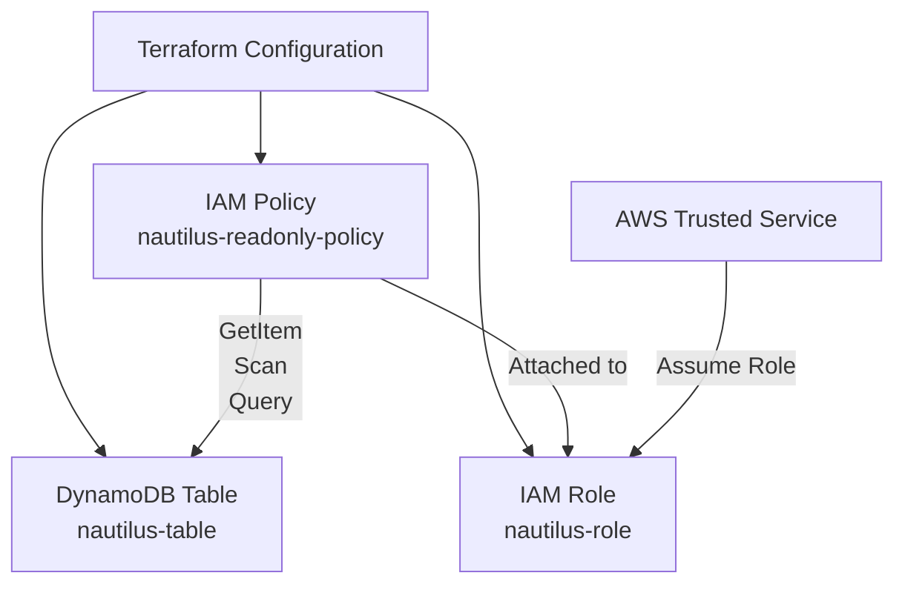

# Terraform DynamoDB Table with IAM Fine-Grained Access Control

## What is the Challenge

The Nautilus DevOps team needs a secure DynamoDB table with fine-grained IAM access control.

The task is to use Terraform to create a DynamoDB table, an IAM role, and an IAM policy that provides only read access to the specific DynamoDB table.

The Terraform configuration must be organized using `main.tf`, `variables.tf`, `terraform.tfvars`, and `outputs.tf`.

The final Terraform plan must report no pending changes before the task is submitted.

## Required Technology to Solve It

The following technologies and resources are used

- Terraform
- AWS DynamoDB
- AWS IAM
- IAM Role
- IAM Policy
- IAM Role Policy Attachment
- Terraform Variables
- Terraform Outputs
- AWS/LocalStack endpoint

### Terraform Working Directory

```text
/home/bob/terraform
```

### Required Files

```text
/home/bob/terraform/
├── main.tf
├── variables.tf
├── terraform.tfvars
└── outputs.tf
```

## Architecture



## How to Solve It

### Step 1: Create the Terraform Working Directory

Open the Terraform working directory

```bash
cd /home/bob/terraform
```

### Step 2: Create `main.tf`

The `main.tf` file contains the provider configuration and all required AWS resources.

The following resources are created

- DynamoDB table
- IAM role
- IAM policy
- IAM role policy attachment

The DynamoDB table uses on-demand billing and a simple string partition key.

The IAM policy allows only

```text
dynamodb:GetItem
dynamodb:Scan
dynamodb:Query
```

The policy resource is restricted to the ARN of the newly created DynamoDB table.

### Step 3: Create `variables.tf`

The following variables are defined

```text
KKE_TABLE_NAME
KKE_ROLE_NAME
KKE_POLICY_NAME
```

These variables allow the resource names to be managed separately from the main Terraform configuration.

### Step 4: Define Values in `terraform.tfvars`

The required values are

```hcl
KKE_TABLE_NAME  = "nautilus-table"
KKE_ROLE_NAME   = "nautilus-role"
KKE_POLICY_NAME = "nautilus-readonly-policy"
```

### Step 5: Create `outputs.tf`

The Terraform outputs expose

```text
kke_dynamodb_table
kke_iam_role_name
kke_iam_policy_name
```

These outputs confirm the names of the resources created by Terraform.

### Step 6: Initialize Terraform

Run

```bash
terraform init
```

This initializes Terraform and downloads the required AWS provider.

### Step 7: Format the Configuration

Run

```bash
terraform fmt
```

This formats the Terraform configuration files.

### Step 8: Validate the Configuration

Run

```bash
terraform validate
```

Expected result

```text
Success! The configuration is valid.
```

### Step 9: Apply the Configuration

Run

```bash
terraform apply
```

Review the planned resources and enter

```text
yes
```

Terraform creates the DynamoDB table, IAM role, IAM policy, and policy attachment.

### Step 10: Verify the Terraform Plan

After the apply operation completes, run

```bash
terraform plan
```

The final result should be

```text
No changes. Your infrastructure matches the configuration.
```

## Main Takeaways

- Terraform can provision DynamoDB and IAM resources together
- IAM policies can provide fine-grained access to a specific DynamoDB table
- Read-only DynamoDB access can be limited to `GetItem`, `Scan`, and `Query`
- Terraform variables make resource names configurable
- Terraform outputs provide useful information about created resources
- `terraform plan` should be checked after deployment to confirm that there are no remaining configuration changes

## Conclusion

The required DynamoDB table, IAM role, IAM read-only policy, and policy attachment were provisioned using Terraform. The configuration was validated and the infrastructure was verified to match the Terraform configuration.
