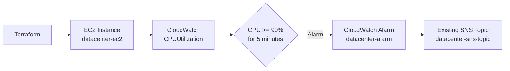

# Create EC2 Instance and Configure CloudWatch CPU Alarm with SNS

## What is the Challenge

The Nautilus DevOps team needs to deploy an EC2 instance and configure monitoring for its CPU utilization using Amazon CloudWatch.

The task requires creating an EC2 instance named `datacenter-ec2` using the provided Ubuntu AMI and creating a CloudWatch alarm named `datacenter-alarm`.

The CloudWatch alarm must monitor the EC2 instance's `CPUUtilization` metric and trigger when the average CPU utilization reaches or exceeds `90%` for one consecutive five-minute period.

An existing SNS topic named `datacenter-sns-topic` is available and must be used as the alarm action.

The Terraform configuration must be created in:

```text
/home/bob/terraform
```

The final Terraform plan must confirm that there are no infrastructure changes pending.

## Required Technology to Solve It

The following technologies and AWS services are required:

- Terraform
- AWS EC2
- AWS CloudWatch
- AWS SNS
- AWS Provider for Terraform
- LocalStack AWS environment

### Required Resources

| Resource           | Name                    |
| ------------------ | ----------------------- |
| EC2 Instance       | `datacenter-ec2`        |
| CloudWatch Alarm   | `datacenter-alarm`      |
| Existing SNS Topic | `datacenter-sns-topic`  |
| AWS Region         | `us-east-1`             |
| EC2 Instance Type  | `t2.micro`              |
| Ubuntu AMI         | `ami-0c02fb55956c7d316` |

## Architecture



The architecture is straightforward:

1. Terraform creates the EC2 instance
2. CloudWatch monitors the instance's CPU utilization
3. The CloudWatch alarm evaluates the CPU metric every five minutes
4. If average CPU utilization reaches or exceeds `90%`, the alarm enters the alarm state
5. The alarm sends its notification to the existing SNS topic

# How to Solve It

## Step 1: Navigate to the Terraform Directory

Move to the required Terraform working directory:

```bash
cd /home/bob/terraform
```

Check the existing files:

```bash
ls
```

The Terraform configuration should contain the required Terraform files such as:

```text
main.tf
outputs.tf
```

## Step 2: Configure `main.tf`

The `main.tf` file contains the AWS provider configuration, the existing SNS topic lookup, the EC2 instance, and the CloudWatch alarm.

### File

```text
/home/bob/terraform/main.tf
```

### Complete `main.tf`

```hcl
terraform {
  required_providers {
    aws = {
      source  = "hashicorp/aws"
      version = "5.91.0"
    }
  }
}

provider "aws" {
  region                      = "us-east-1"
  skip_credentials_validation = true
  skip_requesting_account_id  = true
  s3_use_path_style           = true

  endpoints {
    ec2            = "http://aws:4566"
    apigateway     = "http://aws:4566"
    cloudformation = "http://aws:4566"
    cloudwatch     = "http://aws:4566"
    dynamodb       = "http://aws:4566"
    es             = "http://aws:4566"
    firehose        = "http://aws:4566"
    iam            = "http://aws:4566"
    kinesis        = "http://aws:4566"
    lambda         = "http://aws:4566"
    route53        = "http://aws:4566"
    redshift       = "http://aws:4566"
    s3             = "http://aws:4566"
    secretsmanager = "http://aws:4566"
    ses            = "http://aws:4566"
    sns            = "http://aws:4566"
    sqs            = "http://aws:4566"
    ssm            = "http://aws:4566"
    stepfunctions  = "http://aws:4566"
    sts            = "http://aws:4566"
    rds            = "http://aws:4566"
  }
}

data "aws_sns_topic" "datacenter_sns_topic" {
  name = "datacenter-sns-topic"
}

resource "aws_instance" "datacenter_ec2" {
  ami           = "ami-0c02fb55956c7d316"
  instance_type = "t2.micro"

  tags = {
    Name = "datacenter-ec2"
  }
}

resource "aws_cloudwatch_metric_alarm" "datacenter_alarm" {
  alarm_name          = "datacenter-alarm"
  alarm_description   = "Alarm when EC2 CPU utilization reaches or exceeds 90%"
  comparison_operator = "GreaterThanOrEqualToThreshold"
  evaluation_periods  = 1
  metric_name         = "CPUUtilization"
  namespace           = "AWS/EC2"
  period              = 300
  statistic           = "Average"
  threshold           = 90

  dimensions = {
    InstanceId = aws_instance.datacenter_ec2.id
  }

  alarm_actions = [
    data.aws_sns_topic.datacenter_sns_topic.arn
  ]
}
```

## Step 3: Understand the Existing SNS Topic

The SNS topic was already required to exist, so it should not be recreated as a Terraform-managed resource.

Instead, Terraform retrieves the existing topic using a data source

```hcl
data "aws_sns_topic" "datacenter_sns_topic" {
  name = "datacenter-sns-topic"
}
```

The ARN returned by this data source is then used as the CloudWatch alarm action

```hcl
alarm_actions = [
  data.aws_sns_topic.datacenter_sns_topic.arn
]
```

This allows the CloudWatch alarm to use the existing SNS topic without Terraform attempting to create or manage the topic itself.

## Step 4: Create the EC2 Instance

The EC2 instance is defined using

```hcl
resource "aws_instance" "datacenter_ec2" {
```

The required Ubuntu AMI is

```text
ami-0c02fb55956c7d316
```

The instance type is

```text
t2.micro
```

The instance is given the required name through its tag

```hcl
tags = {
  Name = "datacenter-ec2"
}
```

Therefore, the resulting EC2 instance is

```text
datacenter-ec2
```

## Step 5: Configure the CloudWatch Alarm

The CloudWatch alarm is created with

```hcl
resource "aws_cloudwatch_metric_alarm" "datacenter_alarm" {
```

The alarm name is

```text
datacenter-alarm
```

The alarm monitors

```text
CPUUtilization
```

from the

```text
AWS/EC2
```

namespace.

The metric is associated with the specific EC2 instance using

```hcl
dimensions = {
  InstanceId = aws_instance.datacenter_ec2.id
}
```

This ensures that the alarm monitors the CPU utilization of `datacenter-ec2`.

## Step 6: Configure the CPU Threshold

The alarm must trigger when CPU utilization reaches or exceeds `90%`.

This is configured with

```hcl
comparison_operator = "GreaterThanOrEqualToThreshold"
threshold           = 90
```

Therefore

```text
CPUUtilization >= 90%
```

causes the alarm condition to be satisfied.

## Step 7: Configure the Five-Minute Evaluation Period

The task requires one consecutive five-minute period.

The CloudWatch alarm uses

```hcl
evaluation_periods = 1
period             = 300
```

The `period` value is specified in seconds.

Therefore

```text
300 seconds = 5 minutes
```

The alarm evaluates one five-minute period before changing its state.

## Step 8: Configure Average Statistics

The required statistic is `Average`.

This is configured using

```hcl
statistic = "Average"
```

The alarm therefore evaluates the average CPU utilization during each five-minute period.

## Step 9: Configure the SNS Alarm Action

The existing SNS topic is retrieved through

```hcl
data "aws_sns_topic" "datacenter_sns_topic" {
  name = "datacenter-sns-topic"
}
```

Its ARN is then attached to the CloudWatch alarm

```hcl
alarm_actions = [
  data.aws_sns_topic.datacenter_sns_topic.arn
]
```

The flow is:

```text
EC2 CPU Utilization
        |
        v
CloudWatch Alarm
        |
 CPU >= 90%
        |
        v
SNS Topic
datacenter-sns-topic
```

# Step 10: Configure `outputs.tf`

The task requires two outputs

- `KKE_instance_name`
- `KKE_alarm_name`

### File

```text
/home/bob/terraform/outputs.tf
```

### Complete `outputs.tf`

```hcl
output "KKE_instance_name" {
  description = "Name of the EC2 instance"
  value       = aws_instance.datacenter_ec2.tags["Name"]
}

output "KKE_alarm_name" {
  description = "Name of the CloudWatch alarm"
  value       = aws_cloudwatch_metric_alarm.datacenter_alarm.alarm_name
}
```

# Step 11: Format the Terraform Configuration

Run

```bash
terraform fmt
```

Terraform should format the configuration successfully.

# Step 12: Validate the Configuration

Run

```bash
terraform validate
```

Expected result

```text
Success! The configuration is valid.
```

# Step 13: Initialize Terraform

If Terraform has not already been initialized in the directory, run

```bash
terraform init
```

Terraform initializes the required AWS provider.

# Step 14: Apply the Configuration

Run:

```bash
terraform apply
```

Review the Terraform plan and confirm the resources that Terraform needs to create.

The expected resources are

```text
aws_instance.datacenter_ec2
aws_cloudwatch_metric_alarm.datacenter_alarm
```

The SNS topic should not be managed by the configuration because it is an existing resource referenced through a data source.

# Step 15: Verify the Existing SNS Topic

The SNS topic can be verified using the AWS CLI against LocalStack

```bash
aws sns list-topics \
  --endpoint-url http://aws:4566
```

The expected topic should appear as

```text
arn:aws:sns:us-east-1:000000000000:datacenter-sns-topic
```

# Step 16: Run the Final Terraform Plan

After applying the infrastructure, run:

```bash
terraform plan
```

The final result should be

```text
No changes. Your infrastructure matches the configuration.
```

This confirms that:

- The EC2 instance exists.
- The CloudWatch alarm exists.
- The existing SNS topic is available.
- The CloudWatch alarm references the correct SNS topic.
- Terraform state matches the actual infrastructure.
- There are no pending infrastructure changes.

# CloudWatch Alarm Configuration

| Configuration      | Value                           |
| ------------------ | ------------------------------- |
| Alarm Name         | `datacenter-alarm`              |
| Metric             | `CPUUtilization`                |
| Namespace          | `AWS/EC2`                       |
| Statistic          | `Average`                       |
| Comparison         | `GreaterThanOrEqualToThreshold` |
| Threshold          | `90%`                           |
| Evaluation Periods | `1`                             |
| Period             | `300 seconds`                   |
| Period Duration    | `5 minutes`                     |
| Dimension          | `InstanceId`                    |
| Alarm Action       | `datacenter-sns-topic`          |

# Important Issue Encountered and Resolution

During the initial Terraform apply, the existing SNS topic was accidentally removed from Terraform-managed infrastructure because it existed in Terraform state as

```text
aws_sns_topic.sns_topic
```

but the SNS resource was no longer present in the configuration.

Terraform therefore planned to destroy the topic.

After the topic was destroyed, the following data source could no longer find it

```hcl
data "aws_sns_topic" "datacenter_sns_topic" {
  name = "datacenter-sns-topic"
}
```

The SNS topic was recreated in LocalStack

```bash
aws sns create-topic \
  --name datacenter-sns-topic \
  --endpoint-url http://aws:4566
```

It was then verified with

```bash
aws sns list-topics \
  --endpoint-url http://aws:4566
```

After recreating the topic, Terraform successfully read it and the final plan returned:

```text
No changes. Your infrastructure matches the configuration.
```

This confirmed that the infrastructure was back in the required state.

# Main Takeaways

### 1. Use Data Sources for Existing Resources

When a resource already exists and should not be managed by Terraform, a data source can be used to retrieve its information.

For the SNS topic

```hcl
data "aws_sns_topic" "datacenter_sns_topic" {
  name = "datacenter-sns-topic"
}
```

### 2. CloudWatch Can Monitor EC2 Metrics

The `AWS/EC2` namespace provides metrics such as

```text
CPUUtilization
```

These metrics can be used to trigger CloudWatch alarms.

### 3. Five Minutes Equals 300 Seconds

CloudWatch periods are configured in seconds

```text
300 seconds = 5 minutes
```

### 4. Alarm Actions Can Use SNS

CloudWatch alarms can send notifications through an SNS topic when their configured alarm condition is met.

### 5. Terraform Plan Is an Important Verification Step

Running

```bash
terraform plan
```

after applying the infrastructure verifies whether Terraform detects any difference between the configuration, state, and actual infrastructure.

The desired final result for this task is:

```text
No changes. Your infrastructure matches the configuration.
```

# Conclusion

The required EC2 instance, CloudWatch CPU monitoring alarm, and SNS alarm integration were successfully configured using Terraform. The infrastructure was applied and verified, and the final Terraform plan confirmed that no further changes were required.
